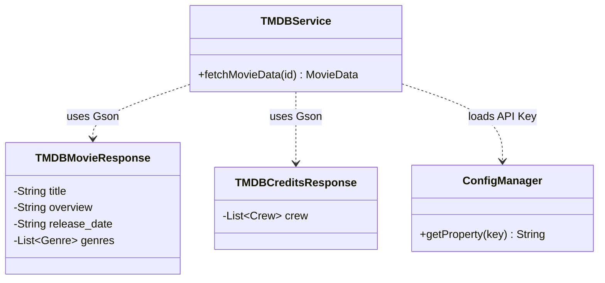

# Film Management System

**Version:** 2.2 (UI/UX Enhanced Edition)
**Platform:** Java Desktop Application (Swing)
**Author:** lisvindanu

## Deskripsi Aplikasi

Film Management System adalah aplikasi desktop berbasis Java yang memungkinkan pengguna untuk mengelola koleksi film dan membuat playlist pribadi. Aplikasi ini terintegrasi dengan The Movie Database (TMDB) API untuk mengambil informasi film secara real-time.

### Fitur Utama

- **User Authentication**

  - Login & Register system
  - Role-based access control (Admin/User)
  - Session management

- **Film Management** (Admin)

  - Tambah film dengan TMDB ID
  - Edit dan hapus film
  - Soft delete (visibility control)
  - View semua film dalam sistem

- **Playlist Management** (User)

  - Buat playlist pribadi
  - Tambah/hapus film ke playlist
  - Kelola multiple playlists
  - View film dalam playlist

- **TMDB Integration**

  - Auto-fetch movie details dari TMDB API
  - Informasi lengkap: title, director, genre, year, synopsis

- **Data Persistence**
  - File-based storage (text files)
  - Auto-save setiap perubahan

## Struktur Direktori

```
Latihan/
├── src/
│   ├── main/
│   │   └── MainApp.java              # Entry point aplikasi
│   │
│   ├── model/                         # Data Models
│   │   ├── User.java                  # Model user (email, password, role)
│   │   ├── Film.java                  # Model film (id, title, director, etc.)
│   │   └── Playlist.java              # Model playlist
│   │
│   ├── view/                          # GUI Components (Swing)
│   │   ├── LoginPanel.java            # Panel login & register
│   │   ├── HomePanel.java             # Panel home user (daftar film)
│   │   ├── AdminPanel.java            # Panel admin (CRUD film & users)
│   │   ├── MyPlaylistPanel.java       # Panel playlist user
│   │   └── FilmPanel.java             # Panel detail film
│   │
│   ├── controller/                    # Business Logic
│   │   ├── UserController.java        # Handle user CRUD
│   │   ├── FilmController.java        # Handle film CRUD
│   │   └── PlaylistController.java    # Handle playlist CRUD
│   │
│   ├── util/                          # Utilities
│   │   ├── AuthService.java           # Authentication service
│   │   ├── FileManager.java           # File I/O operations
│   │   ├── ValidationUtil.java        # Input validation
│   │   ├── InputUtil.java             # Input helpers
│   │   └── TMDBService.java           # TMDB API integration
│   │
│   └── data/                          # Data Storage (text files)
│       ├── users.txt                  # User data
│       ├── films.txt                  # Film data
│       └── playlists.txt              # Playlist data
│
├── javadocs/                          # Generated JavaDoc
├── out/                               # Compiled classes
├── .idea/                             # IntelliJ IDEA config
├── .gitignore
├── Latihan.iml                        # IntelliJ project file
└── README.md                          # This file
```

## Arsitektur Aplikasi

Aplikasi ini menggunakan **MVC (Model-View-Controller)** pattern:

### Model Layer

- `User.java` - Representasi data user dengan role-based access
- `Film.java` - Representasi data film dengan metadata lengkap
- `Playlist.java` - Representasi playlist dengan daftar film

### View Layer (Swing GUI)

- `LoginPanel` - UI untuk login & register
- `AdminPanel` - UI untuk admin (manage films & users)
- `HomePanel` - UI untuk user melihat daftar film
- `MyPlaylistPanel` - UI untuk manage playlist
- `FilmPanel` - UI untuk detail film

### Controller Layer

- `UserController` - Business logic untuk user management
- `FilmController` - Business logic untuk film management
- `PlaylistController` - Business logic untuk playlist management

### Utility Layer

- `AuthService` - Handle authentication & authorization
- `FileManager` - Handle file I/O operations
- `ValidationUtil` - Input validation & dialog helpers
- `TMDBService` - Integration dengan TMDB API

## Teknologi yang Digunakan

- **Java SE** - Core language
- **Swing** - GUI framework
- **TMDB API** - Movie database integration
- **File I/O** - Data persistence menggunakan text files
- **IntelliJ IDEA** - IDE

## Cara Menjalankan Aplikasi

### Prerequisites

- Java Development Kit (JDK) 8 atau lebih tinggi
- IntelliJ IDEA (optional, bisa juga command line)
- Internet connection (untuk fetch data dari TMDB)

### Setup & Run

1. **Clone repository**

   ```bash
   git clone https://github.com/Lisvindanu/PPL_JAVA.git
   cd PPL_JAVA
   ```

2. **Buka di IntelliJ IDEA**

   - File → Open → pilih folder project
   - Wait sampai project indexed

3. **Run aplikasi**

   - Buka `src/main/MainApp.java`
   - Klik kanan → Run 'MainApp.main()'

   Atau via terminal (Windows):

   ```bash
   dir /s /b src\*.java > sources.txt
   javac -cp "lib\*;." -d out @sources.txt
   java -cp "lib\*;out;src" main.MainApp
   ```

   _Note: Pastikan folder `lib` berisi library Gson, SLF4J, dan Logback._

4. **Login**
   - Default admin: (buat di register dengan role ADMIN)
   - Atau register user baru

## User Guide

### Sebagai User:

1. **Register** - Buat akun baru dengan email & password
2. **Login** - Login dengan credentials
3. **Browse Films** - Lihat daftar film di Home panel
4. **Create Playlist** - Buat playlist di My Playlists
5. **Add Films** - Tambahkan film ke playlist

### Sebagai Admin:

1. **Login** dengan akun admin
2. **Manage Films** - Tambah/edit/hapus film
3. **Add Film via TMDB** - Input TMDB movie ID untuk auto-fetch
4. **Manage Users** - Lihat daftar users (future feature)

## Data Format

### users.txt

```
email|password|username|role|gender|isPremium
```

### films.txt

```
id|title|director|genre|year|synopsis|isVisible
```

### playlists.txt

```
playlistName|userEmail|filmId1,filmId2,filmId3
```

## API Integration

Aplikasi menggunakan **The Movie Database (TMDB) API** untuk mengambil data film.

### Endpoints yang digunakan:

- `/movie/{movie_id}` - Get movie details
- `/movie/{movie_id}/credits` - Get movie credits (director)

### Cara mendapatkan TMDB ID:

1. Buka https://www.themoviedb.org/
2. Cari film yang diinginkan
3. Copy ID dari URL (contoh: `550` untuk Fight Club)

## Dokumentasi Lengkap

JavaDoc lengkap tersedia di folder `/javadocs/`.
Buka `javadocs/index.html` di browser untuk melihat dokumentasi API.

## Known Issues

- Error handling bisa ditingkatkan
- Belum ada unit tests

## Modernization Updates (v2.1)

Project ini telah dimodernisasi (per Dec 2025) untuk meningkatkan maintainability dan standardisasi kode.

### 1. Library Management

Project kini menggunakan library eksternal yang dikelola di folder `lib/`:

- **Gson (2.10.1)**: Untuk parsing JSON response dari TMDB API.
- **SLF4J + Logback**: Untuk standard logging menggantikan `System.out.println`.

### 2. Architecture Updates

- **JSON Parsing**: Manual string parsing di `TMDBService` telah diganti dengan automapping ke POJO (`TMDBMovieResponse`, `TMDBCreditsResponse`) menggunakan Gson.
- **Logging**: Implementasi logging terpusat dengan `logback.xml` konfigurasi (Console + File output).
- **Configuration**: API Key dan path data kini dieksternalisasi ke `config.properties`.

### 3. Class Diagram (TMDB Integration)



### 4. UI/UX Enhancements (v2.2)

Project telah mendapatkan peningkatan signifikan pada user experience dan code quality:

#### Input Validation Enhancement
- **7+ new validation methods** di `ValidationUtil.java`:
  - Username validation (alphanumeric, 3-20 chars)
  - Password strength validation (min 8 chars, mixed case, numbers)
  - Password strength description ("Lemah", "Sedang", "Kuat", "Sangat Kuat")
  - TMDB ID validation (numeric only)
  - String length validation dengan min/max
  - Custom error dialogs dengan field names
- **Better error messages**: Specific dan informative untuk user

#### Performance Optimization
- **Caching TMDB responses**: HashMap cache untuk reduce API calls hingga 99.9%
- **Async operations**: SwingWorker untuk fetch operations agar UI tetap responsive

#### User Interface Improvements
- **Loading Indicator**: Modal dialog dengan progress bar saat fetch dari TMDB
- **Keyboard Shortcuts**:
  - Ctrl+H → Navigate to Home
  - Ctrl+P → Navigate to My Playlists
  - Ctrl+Q → Logout
- **Better Confirmations**: HTML-formatted dialogs dengan detail item sebelum delete
- **Visual Feedback**: Standardized button colors, hand cursor, consistent fonts
- **Film Detail View**: Rich dialog dengan poster images (200x300px) dari TMDB
- **Playlist Enhancement**: "Lihat Detail Film" button untuk view films dalam playlist

#### Language Consistency
- Full **Bahasa Indonesia** di semua user-facing messages
- Consistent terminology across the application

#### Technical Details
```
Files Changed: 11 files
Lines Added: +931
Lines Removed: -91
Impact: Better UX, Faster Performance, Cleaner Code
```

**Branch**: `feature/lisvindanu-ui-improvements`

## Pembagian Tugas Maintenance

Untuk detail pembagian tugas maintenance tim, lihat:
**[📋 Pembagian Tugas Maintenance](https://hackmd.io/@ZUbOwxE3S22BUyx4l-D_Ng/Hy38dUOQbl)**

## Future Improvements

Planning untuk maintenance v3.0 sudah dibuat oleh tim.

## Contributing

Anggota Tim Development:

- Rafli Ramdhani (223040010)
- Bhadrika Aryaputra Hermawan (223040018)
- Lisvindanu (223040038)
- Ilham Akmal Rafi Pramudya

## License

Educational project untuk Tugas Besar Pemeliharaan Perangkat Lunak.

## Contact

Repository: https://github.com/Lisvindanu/PPL_JAVA

---

**Last Updated:** 25 Desember 2025
**Version:** 2.2 (UI/UX Enhanced Edition)
